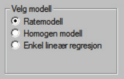
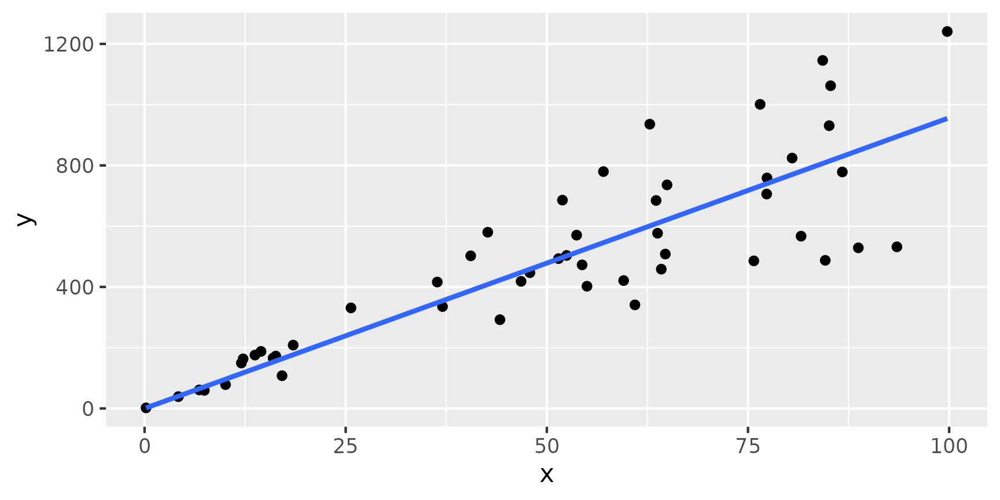
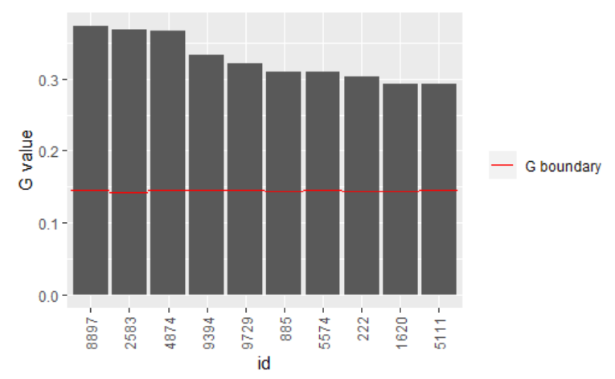
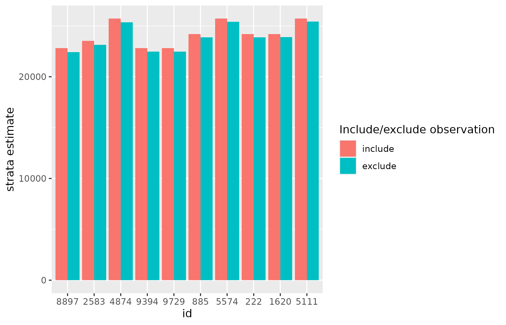
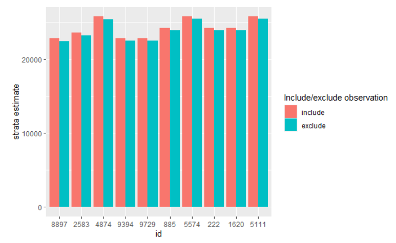

# Estimation using struktuR

### Introduction

The `struktuR` package is used to estimate totals and their uncertainty
from sample survey data, with particular focus on business surveys. It
contains functions which replicates and builds on the estimation and
functionality used in Statistic Norway’s internally developed
SAS-application Struktur ([Using
SAS-Struktur](https://www.ssb.no/a/publikasjoner/pdf/notat_200730/notat_200730.pdf),
Norsk). Documentation on this earlier application will be referenced
here to aid those wishing to move their statistical production (or parts
of it) to R.

The main purpose of the functions is to:

- Estimate totals for statistic variables for the country and within
  strata and groups.
- Provide estimations for variance to indicate the quality of the
  estimated totals.
- Identify outlier/extreme observations that may be having a overly high
  influence on the statistics.

The estimation method is a model-based estimate using a **homogenous**,
**rate** or **regression** model. These are described further in more
details later in this document.

### Package installation

For internal Statistic Norway users, the package is already installed on
many of the production servers and this step may be skipped. For other
users the package can be installed from github using the `devtools`
function `install_github`. This step only needs to be run one time.

``` r
devtools::install_github("statisticsnorway/ssb-struktur")
```

To access and use the functions in the package we need to run `library`
each time we start a new R session.

``` r
library(struktuR)
```

### Data requirements

The purpose of the functions used for estimation is to take information
from a sample of units (for example a sample of companies) and make
inferences on the remaining units in the population to find an
estimation for the total. For this we need data on both the *sample* and
*population*. This can be two separate data sets or one full/population
data set with information on the statistics variable for those units in
the sample. When there are two data sets, the following variables should
be included:

**Population data set**:

- ID variable which is consistent in both the population and sample data
  sets (`id`).
- An explanatory variable when using regression and rate models (`x`).
  This is a variable which the statistic variable is correlated with.
- A strata variable which divides the population into groups which are
  similar to each other. This is the smallest grouping variable and
  which seperate models will be run on.
- Domain variables (or publication groups) for producing statistical
  totals for. These should be able to be created by joining strata
  groups together.

**Sample data set**:

- ID variable (`id`)
- The explanatory variable when using regression and rate models, but
  can be missing (`x`)
- The statistic variable(s) we are interested in estimating (`y`)

**Example data** There are two synthetic data sets in the package for
examples: pop_data, sample_data. `pop_data` represents a population data
set with 10000 rows, each one representing a company. The variable
`employees` is the number of employees in the company and provides an
explanatory variable used in many of Statistic Norway’s current
estimation models. Variables `emplyees_f` and `employees_m` give the
breakdown for number of male and female employees. `Turnover` provides
an alternative explanatory variable. Variables `size` and `industry`
providing options for stratification.

``` r
head(pop_data)
```

|  id | employees | employees_f | employees_m |  turnover | size  | industry |
|----:|----------:|------------:|------------:|----------:|:------|:---------|
|   1 |         0 |           0 |           0 |  15396.54 | small | B        |
|   2 |        75 |          15 |          60 |  78814.71 | mid   | B        |
|   3 |        55 |          42 |          13 |  97128.26 | mid   | B        |
|   4 |        56 |          32 |          24 |  60414.60 | mid   | B        |
|   5 |       110 |          13 |          97 | 237306.65 | big   | B        |
|   6 |       172 |          50 |         122 | 473721.22 | big   | B        |

The data set `sample_data` contains 1000 rows representing a sample of
companies. In addition to the variables listed previously it contains a
`job_vacancies` representing the number of job positions advertised for
the year as an example statistic variable. Variables `sick_days`,
`sick_days_f` and `sick_days_m` give addition statistic variables for
the number of days lost to sick leave, broken down into male and female.

``` r
head(sample_data)
```

|  id | employees | employees_f | employees_m |   turnover | size  | industry | job_vacancies | sick_days | sick_days_f | sick_days_m |
|----:|----------:|------------:|------------:|-----------:|:------|:---------|--------------:|----------:|------------:|------------:|
|   5 |       132 |          13 |          97 | 237306.653 | big   | B        |             1 |       515 |         278 |         237 |
|   9 |        28 |          11 |          10 |  63848.919 | mid   | B        |             8 |       134 |         127 |           7 |
|  12 |        35 |           6 |           1 |  11462.578 | small | B        |             3 |        21 |          17 |           4 |
|  14 |       155 |           1 |         170 |   7934.057 | big   | B        |            16 |       632 |         540 |          92 |
|  25 |       167 |          81 |          61 | 408964.032 | big   | B        |             9 |       337 |         200 |         137 |
|  55 |       124 |          31 |          45 | 118718.363 | mid   | B        |             7 |       525 |         151 |         374 |

### Model choice

The main function for estimation in the R package is called
`struktur_model` and uses the parameter `method` to define the model of
choice. The default setting is set to run a **rate** model but can also
be a **homogenous** or **regression** model. This is similar to the
choice given in the SAS-Struktur application



A **homogenous** model is useful when there are no available additional
variables that are correlated with the statistics variable. A **rate**
model is used when there is one variable available for all units in the
population which has a good correlation with the statistics variable. A
**regression** model can also be used when there is a variable available
in the population but can also be adapted for cases with multiple
explanatory variables. It also has an assumption that the residuals in
the model are not related to the explanatory variables.

The `struktuR` package currently only supports the use of a **rate**
model for estimation. Contact Statistic’s Norway’s Methods department if
you wish to test either of the other models.

#### Rate model

A rate model can be described with the general formula:
$$y_{hi} = \beta_{h}x_{hi} + \epsilon_{hi}$$ where $i = 1,2,...,N_{h}$
and is the units in the sample in the stratum, $h$, $y$ is the
statistics variable available in the sample and $x$ is the explanatory
variable.

For a rate model, the distribution of the error term, or residuals, is
assumed to correlate with the explanatory variable, $x$. Thereby
$$Var\left( \epsilon_{hi} \right) = x_{hi}\sigma_{h}^{2}$$ An easy way
to see if a rate model might be a good choice, is to start with plotting
the statistics variable against the explanatory variable. If there
appears to be a linear pattern, but the points vary more from the linear
correlation when they themselves are larger it will result in a funnel
type shape. This can be seen in the example:  


Another difference is that rate models do not have an intercept term
whereas regression models often do. This means that when the explanatory
variable (`x`) is 0, then it should make sense for the statistic
variable (`y`) to also be 0.

### Estimation

The main function, `struktur_model` is used to perform the modeling and
estimation. This function will fit the chosen model within strata groups
then predict it for the population as a whole. The population and sample
datasets must be provided, along with explanatory variable, statistic
variable(s), id and strata variables. Here we use industry groups in the
example data as the strata variable.

``` r
results <- struktur_model(pop_data, sample_data, 
                          x = "employees", 
                          y = "job_vacancies", 
                          id = "id",
                          strata = "industry")
```

|  id | employees | employees_f | employees_m |  turnover | size  | industry | job_vacancies | s_flag | .strata | employees_pop | employees_utv | job_vacancies_pop | job_vacancies_utv | job_vacancies_beta | job_vacancies_beta_ex | job_vacancies_rstud | job_vacancies_hat | job_vacancies_G | job_vacancies_imp | job_vacancies_flag |
|----:|----------:|------------:|------------:|----------:|:------|:---------|--------------:|-------:|:--------|--------------:|--------------:|------------------:|------------------:|-------------------:|----------------------:|--------------------:|------------------:|----------------:|------------------:|:-------------------|
|   1 |         0 |           0 |           0 |  15396.54 | small | B        |            NA |      0 | B       |        165769 |         15997 |              2000 |               193 |          0.1459024 |                    NA |                  NA |                NA |              NA |          0.000000 | pred               |
|   2 |        75 |          15 |          60 |  78814.71 | mid   | B        |            NA |      0 | B       |        165769 |         15997 |              2000 |               193 |          0.1459024 |                    NA |                  NA |                NA |              NA |         10.942677 | pred               |
|   3 |        55 |          42 |          13 |  97128.26 | mid   | B        |            NA |      0 | B       |        165769 |         15997 |              2000 |               193 |          0.1459024 |                    NA |                  NA |                NA |              NA |          8.024630 | pred               |
|   4 |        56 |          32 |          24 |  60414.60 | mid   | B        |            NA |      0 | B       |        165769 |         15997 |              2000 |               193 |          0.1459024 |                    NA |                  NA |                NA |              NA |          8.170532 | pred               |
|   5 |       110 |          13 |          97 | 237306.65 | big   | B        |             1 |      1 | B       |        165769 |         15997 |              2000 |               193 |          0.1459024 |             0.1470533 |           -2.085257 |       0.008251547 |       -0.190207 |          1.000000 | mod                |
|   6 |       172 |          50 |         122 | 473721.22 | big   | B        |            NA |      0 | B       |        165769 |         15997 |              2000 |               193 |          0.1459024 |                    NA |                  NA |                NA |              NA |         25.095205 | pred               |

The result is a population dataset with added columns. It acts as a
mass-imputed file where totals and variances can be calculated from.

The general explanatory, `x`, variables added include:

- `employees_pop` gives the sum of the explanatory (employees) for the
  stratum in the population.
- `employees_utv` gives the sum of the explanatory (employees) for the
  stratum in the sample.

The prefix *employees* will be replaced with the name of the explanatory
variable chosen when run using a different data set.

Statistic variables added include:

- `job_vacancies_pop` gives the count/number of observations in the
  population for the stratum.
- `job_vacancies_utv` gives the count/number of observations in the
  sample for the stratum.
- `job_vacancies_beta` gives the estimate of the $\beta$ value from the
  model for the stratum.
- `job_vacancies_beta_ex` gives the estimate of the $\beta$ value from
  the model for the stratum if that specific observation is removed from
  the model.
- `job_vacancies_rstud`, `job_vacancies_hat`, `job_vacancies_G` provide
  the studentized residuals, hat values and G-value used for identifying
  outliers and calculating variances
- `job_vacancies_imp` provides the model based imputation for the
  statistic variable.
- `job_vacancies_flag` provides an indicator on whether the value of
  `job_vacancies_imp` is predicted (`pred`), is observed and contributes
  to the model `mod`) or is observed but excluded from the model (`ex`).

Again, the prefix *job_vacancies* will be replaced with the name of the
statistical variable chosen when run on a different data set.

An additional parameter `exclude` in the function, allows you to include
a list of ID’s to exclude from the modelling. This can be useful is
there are some extreme values which will heavily influence the results
but are most likely correct values.

### View results and uncertainty

To summarize and view the results you can use the function `get_results`
with the first input parameter being the output data set from the main
`struktur_model`function. This will give estimates for the total of the
statistical variable in addition to the variance (`job_vacanices_var`),
upper and lower bounds (`job_vacancies_UB` and `job_vacancies_LB`). The
coefficient og variation is given for three robust variance methods
(`job_vacancies_CV1`, `job_vacancies_CV2` and `job_vacancies_CV3`) with
*variance 2* being the default used as the varience for the upper and
lower bound varaibles. These are all described in the [Using
SAS-struktur guide (page
25)](https://www.ssb.no/a/publikasjoner/pdf/notat_200730/notat_200730.pdf).
The results are provided per strata if a grouping/domain variable is not
provided.

If the `exclude` parameter is use in the `struktur_model` function an
additional “suprise strata” is created containing all the observations
to exclude from the model. This strata will be shown in the results.

``` r
results_table <- get_results(results)
results_table 
```

| industry | employees_pop | employees_utv | job_vacancies_pop | job_vacancies_utv | job_vacancies_est | job_vacancies_var | job_vacancies_UB | job_vacancies_LB | job_vacancies_CV1 | job_vacancies_CV2 | job_vacancies_CV3 |
|:---------|--------------:|--------------:|------------------:|------------------:|------------------:|------------------:|-----------------:|-----------------:|------------------:|------------------:|------------------:|
| B        |        165769 |         15997 |              2000 |               193 |          24186.09 |           1477434 |         26568.46 |         21803.71 |          5.000508 |          5.025606 |          5.050884 |
| C        |        166222 |         16484 |              2000 |               196 |          23535.68 |           1881763 |         26224.36 |         20847.00 |          5.801299 |          5.828485 |          5.855847 |
| D        |        160949 |         15037 |              2000 |               191 |          25720.59 |           1604171 |         28203.04 |         23238.13 |          4.897947 |          4.924300 |          4.950855 |
| E        |        164038 |         19319 |              2000 |               219 |          23520.12 |           1281820 |         25739.19 |         21301.06 |          4.792041 |          4.813643 |          4.835400 |
| F        |        161212 |         15138 |              2000 |               191 |          22811.21 |           2073611 |         25633.62 |         19988.80 |          6.277441 |          6.312702 |          6.348270 |

### View domain estimations

We generally don’t publish statistics at the strata-level. This is
usually most useful for the modeling/estimation process. To view results
for total estimates and uncertainty for publishing domains we can use
the `get_results` function with the `group` parameter. For example to
view results for the entire population/country level and industry
levels:

``` r
results$country <- 1
get_results(results, group = c("country", "industry"))
```

| group_name | group | job_vacancies_est | job_vacancies_var | job_vacancies_UB | job_vacancies_LB | job_vacancies_CV1 | job_vacancies_CV2 | job_vacancies_CV3 |
|:-----------|:------|------------------:|------------------:|-----------------:|-----------------:|------------------:|------------------:|------------------:|
| country    | 1     |         119773.69 |           8318798 |        125426.78 |        114120.59 |          2.395889 |          2.408069 |          2.420341 |
| industry   | B     |          24186.09 |           1477434 |         26568.46 |         21803.71 |          5.000508 |          5.025606 |          5.050884 |
| industry   | C     |          23535.68 |           1881763 |         26224.36 |         20847.00 |          5.801299 |          5.828485 |          5.855847 |
| industry   | D     |          25720.59 |           1604171 |         28203.04 |         23238.13 |          4.897947 |          4.924300 |          4.950855 |
| industry   | E     |          23520.12 |           1281820 |         25739.19 |         21301.06 |          4.792041 |          4.813643 |          4.835400 |
| industry   | F     |          22811.21 |           2073611 |         25633.62 |         19988.80 |          6.277441 |          6.312702 |          6.348270 |

In this case any observations that were excluded from the model and are
placed in the “surprise strata” will now be included in the total (but
do not contribute to the variance).

### View outliers

To look for extreme values we can use the `get_extremes` function to
create a table og potential problematic values. We simple run this
function on the output data set from the main `struktur_model` function.

``` r
outliers <- get_extremes(data = results)
head(outliers)
```

|   id | industry | employees | job_vacancies | job_vacancies_utv | job_vacancies_est | job_vacancies_est_ex | job_vacancies_G | job_vacancies_rstud | job_vacancies_G_grense | job_vacancies_rstud_grense |
|-----:|:---------|----------:|--------------:|------------------:|------------------:|---------------------:|----------------:|--------------------:|-----------------------:|---------------------------:|
| 8897 | F        |       209 |            68 |               191 |          22811.21 |             22426.30 |       0.3732072 |            3.011318 |              0.1447149 |                          2 |
| 2583 | C        |       245 |            74 |               196 |          23535.68 |             23139.00 |       0.3687849 |            2.977828 |              0.1428571 |                          2 |
| 4874 | D        |       214 |            74 |               191 |          25720.59 |             25351.70 |       0.3667711 |            2.815034 |              0.1447149 |                          2 |
| 9394 | F        |       393 |            90 |               191 |          22811.21 |             22464.15 |       0.3321278 |            1.985633 |              0.1447149 |                          2 |
| 9729 | F        |       239 |            66 |               191 |          22811.21 |             22478.08 |       0.3206109 |            2.479199 |              0.1447149 |                          2 |
|  885 | B        |       301 |            71 |               193 |          24186.09 |             23875.72 |       0.3101890 |            2.303136 |              0.1439632 |                          2 |

This produces a table with possible outliers. The ID and strata
variables are provided along the the explanatory and statistical
varaibles. The estimate for the strata total that the observation is
given (`job_vacancies_est`) and also the strata estimate if the
observation was excluded from the model, but the observed value was
included in the total (`job_vacancies_est_ex`).

The `G`and `rstud` values are given for the observations and the
threshold values used. These give an indication of how close they are to
an average, or expected value given the size of the explanatory variable
value. The methods for these are described further in [Using
SAS-Struktur](https://www.ssb.no/a/publikasjoner/pdf/notat_200730/notat_200730.pdf).

Only observations with values above the threshold for `G` or `rstud` are
given in the table.

To view outliers in a figure you can use the function `plot_extreme`,
inputting the dataset given from the `get_extreme`function. This is a
way to get a quick view of the potential outliers. The default plot
gives the `G`-values.

``` r
plot_extreme(outliers)
# Warning: `aes_string()` was deprecated in ggplot2 3.0.0.
# ℹ Please use tidy evaluation idioms with `aes()`.
# ℹ See also `vignette("ggplot2-in-packages")` for more information.
# ℹ The deprecated feature was likely used in the struktuR package.
#   Please report the issue to the authors.
# This warning is displayed once per session.
# Call `lifecycle::last_lifecycle_warnings()` to see where this warning was
# generated.
```




Alternatively, you can plot a comparison of the strata estimates with
and without that point.

``` r
plot_extreme(outliers, type = "estimate")
```




