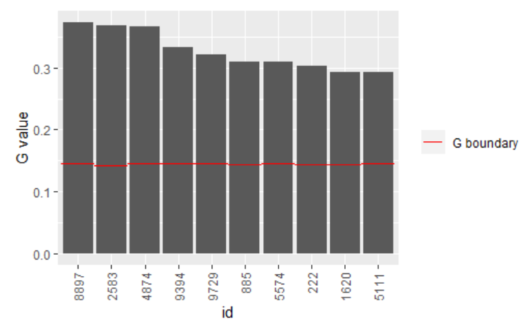
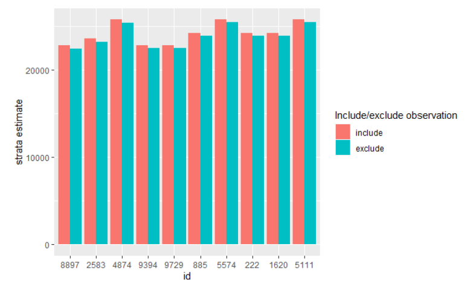

### Introduction
The `struktuR` package is used to estimate totals and their uncertainty from sample survey data, with particular focus on business surveys. It contains functions which replicates and builds on the estimation and functionality used in Statistic Norway's internally developed SAS-application Struktur ([Using SAS-Struktur](https://www.ssb.no/a/publikasjoner/pdf/notat_200730/notat_200730.pdf), Norsk). Documentation on this earlier application will be referenced here to aid those wishing to move their statistical production (or parts of it) to R.

The main purpose of the functions is to:

* Estimate totals for statistic variables for the country and within strata and groups.
* Provide estimations for variance to indicate the quality of the estimated totals.
* Identify outlier/extreme observations that may be having a overly high influence on the statistics.

The estimation method is a model-based estimate using a **homogenous**, **rate** or **regression** model. These are described further in more details later in this document.  


```{r, include = FALSE}
options(rmarkdown.html_vignette.check_title = FALSE)
library(knitr)
library(kableExtra)
library(magrittr)
knitr::opts_chunk$set(
  collapse = TRUE,
  comment = "#",
  error = FALSE,
  tidy = FALSE,
  cache = FALSE,
  collapse = TRUE,
  out.width = '100%',
  dpi = 144
)
```

### Package installation
For internal Statistic Norway users, the package is already installed on many of the production servers and this step may be skipped. For other users the package can be installed from github using the `devtools` function `install_github`. This step only needs to be run one time.

```{r install, eval=FALSE}
devtools::install_github("statisticsnorway/struktuR")
```

To access and use the functions in the package we need to run `library` each time we start a new R session.

```{r}
library(struktuR)
```

### Data requirements
The purpose of the functions used for estimation is to take information from a sample of units (for example a sample of companies) and make inferences on the remaining units in the population to find an estimation for the total. For this we need data on both the *sample* and *population*. This can be two separate data sets or one full/population data set with information on the statistics variable for those units in the sample. When there are two data sets, the following variables should be included:

**Population data set**:

* ID variable which is consistent in both the population and sample data sets (`id`).
* An explanatory variable when using regression and rate models (`x`). This is a variable which the statistic variable is correlated with.
* A strata variable which divides the population into groups which are similar to each other. This is the smallest grouping variable and which seperate models will be run on.
* Domain variables (or publication groups) for producing statistical totals for. These should be able to be created by joining strata groups together.
 
**Sample data set**:

* ID variable (`id`)
* The explanatory variable when using regression and rate models, but can be missing (`x`)
* The statistic variable(s) we are interested in estimating (`y`)

**Example data**
There are two synthetic data sets in the package for examples: pop_data, sample_data. `pop_data` represents a population data set with 10000 rows, each one representing a company. The variable `employees` is the number of employees in the company and provides an explanatory variable used in many of Statistic Norway's current estimation models. Variables `emplyees_f` and `employees_m` give the breakdown for number of male and female employees. `Turnover` provides an alternative explanatory variable. Variables `size` and `industry` providing options for stratification. 

```{r, eval = F}
head(pop_data)
```

```{r, echo = F}
kable(head(pop_data)) %>%
  kable_styling()
```

The data set `sample_data` contains 1000 rows representing a sample of companies. In addition to the variables listed previously it contains a `job_vacancies` representing the number of job positions advertised for the year as an example statistic variable. Variables `sick_days`, `sick_days_f` and `sick_days_m` give addition statistic variables for the number of days lost to sick leave, broken down into male and female.

```{r, eval = F}
head(sample_data)
```

```{r, echo = F}
kable(head(sample_data)) %>%
  kable_styling() %>%
  kableExtra::scroll_box(width = "100%", height = "250px")
```


### Model choice
The main function for estimation in the R package is called `struktur_model` and uses the parameter `method` to define the model of choice. The default setting is set to run a **rate** model but can also be a **homogenous** or **regression** model. This is similar to the choice given in the SAS-Struktur application


A **homogenous** model is useful when there are no available additional variables that are correlated with the statistics variable. A **rate** model is used when there is one variable available for all units in the population which has a good correlation with the statistics variable. A **regression** model can also be used when there is a variable available in the population but can also be adapted for cases with multiple explanatory variables. It also has an assumption that the residuals in the model are not related to the explanatory variables. 

The `struktuR` package currently only supports the use of a **rate** model for estimation. Contact Statistic's Norway's Methods department if you wish to test either of the other models.

#### Rate model
A rate model can be described with the general formula: 
$$
y_{hi} = \beta_{h}x_{hi} + \epsilon_{hi}
$$
where $i = 1, 2, ..., N_h$ and is the units in the sample in the stratum, $h$, $y$ is the statistics variable available in the sample and $x$ is the explanatory variable.

For a rate model, the distribution of the error term, or residuals, is assumed to correlate with the explanatory variable, $x$. Thereby
$$
Var(\epsilon_{hi})= x_{hi}\sigma_h^2
$$
An easy way to see if a rate model might be a good choice, is to start with plotting the statistics variable against the explanatory variable. If there appears to be a linear pattern, but the points vary more from the linear correlation when they themselves are larger it will result in a funnel type shape. This can be seen in the example:  
```{r, echo = FALSE, fig.height=3, fig.width=6}
library(ggplot2)
set.seed(2022)
residdata <- data.frame(x = runif(50)*100)
residdata$y = residdata$x * 10 + residdata$x * runif(50, min = -5, max = 5)
ggplot(residdata, aes(x, y)) + 
  geom_point() +
  geom_smooth(method='lm', formula='y~x-1', se = FALSE)

```

Another difference is that rate models do not have an intercept term whereas regression models often do. This means that when the explanatory variable (`x`) is 0, then it should make sense for the statistic variable (`y`) to also be 0. 

### Estimation
The main function, `struktur_model` is used to perform the modeling and estimation. This function will fit the chosen model within strata groups then predict it for the population as a whole. The population and sample datasets must be provided, along with explanatory variable, statistic variable(s), id and strata variables. Here we use industry groups in the example data as the strata variable.

```{r, message=FALSE, eval = F}
results <- struktur_model(pop_data, sample_data, 
                          x = "employees", 
                          y = "job_vacancies", 
                          id = "id",
                          strata = "industry")
```


```{r, message=FALSE, echo = F}
results <- struktur_model(pop_data, sample_data, 
                          x = "employees", 
                          y = "job_vacancies", 
                          id = "id",
                          strata = "industry")
kable(head(results)) %>%
  kable_styling() %>%
  kableExtra::scroll_box(width = "100%", height = "250px")

```

The result is a population dataset with added columns. It acts as a mass-imputed file where totals and variances can be calculated from.

The general explanatory, `x`, variables added include:

- `employees_pop` gives the sum of the explanatory (employees) for the stratum in the population.
- `employees_utv` gives the sum of the explanatory (employees) for the stratum in the sample.


The prefix *employees* will be replaced with the name of the explanatory variable chosen when run using a different data set.

Statistic variables added include:

- `job_vacancies_pop` gives the count/number of observations in the population for the stratum.
- `job_vacancies_utv` gives the count/number of observations in the sample for the stratum.
- `job_vacancies_beta` gives the estimate of the $\beta$ value from the model for the stratum.
- `job_vacancies_beta_ex` gives the estimate of the $\beta$ value from the model for the stratum if that specific observation is removed from the model.
- `job_vacancies_rstud`, `job_vacancies_hat`, `job_vacancies_G` provide the studentized residuals, hat values and G-value used for identifying outliers and calculating variances
- `job_vacancies_imp` provides the model based imputation for the statistic variable.
- `job_vacancies_flag` provides an indicator on whether the value of `job_vacancies_imp` is predicted (`pred`), is observed and contributes to the model `mod`) or is observed but excluded from the model (`ex`). 

Again, the prefix *job_vacancies* will be replaced with the name of the statistical variable chosen when run on a different data set.

An additional parameter `exclude` in the function, allows you to include a list of ID's to exclude from the modelling. This can be useful is there are some extreme values which will heavily influence the results but are most likely correct values.   

### View results and uncertainty
To summarize and view the results you can use the function `get_results` with the first input parameter being the output data set from the main `struktur_model`function. This will give estimates for the total of the statistical variable in addition to the variance (`job_vacanices_var`), upper and lower bounds (`job_vacancies_UB` and `job_vacancies_LB`). The coefficient og variation is given for three robust variance methods (`job_vacancies_CV1`, `job_vacancies_CV2` and `job_vacancies_CV3`) with *variance 2* being the default used as the varience for the upper and lower bound varaibles. These are all described in the [Using SAS-struktur guide (page 25)](https://www.ssb.no/a/publikasjoner/pdf/notat_200730/notat_200730.pdf). The results are provided per strata if a grouping/domain variable is not provided.

If the `exclude` parameter is use in the `struktur_model` function an additional "suprise strata" is created containing all the observations to exclude from the model. This strata will be shown in the results. 

```{r, eval = F}
results_table <- get_results(results)
results_table 
```


```{r, echo = F}
results_table = get_results(results)
kable(head(results_table)) %>%
  kable_styling() %>%
  kableExtra::scroll_box(width = "100%", height = "250px")
```


### View domain estimations
We generally don't publish statistics at the strata-level. This is usually most useful for the modeling/estimation process. To view results for total estimates and uncertainty for publishing domains we can use the `get_results` function with the `group` parameter. For example to view results for the entire population/country level and industry levels:

```{r, eval = F}
results$country <- 1
get_results(results, group = c("country", "industry"))
```

```{r, echo = F, warnings=F}
results$country <- 1
gg <- get_results(results, group = c("country", "industry"))
kable(gg)%>%
  kable_styling() 
```

In this case any observations that were excluded from the model and are placed in the "surprise strata" will now be included in the total (but do not contribute to the variance). 

### View outliers
To look for extreme values we can use the `get_extremes` function to create a table og potential problematic values. We simple run this function on the output data set from the main `struktur_model` function.  

```{r, eval = F}
outliers <- get_extremes(data = results)
head(outliers)
```

```{r, echo = F}
outliers <- get_extremes(results)
kable(head(outliers)) %>%
  kable_styling() %>%
  kableExtra::scroll_box(width = "100%", height = "250px")
```

This produces a table with possible outliers. The ID and strata variables are provided along the the explanatory and statistical varaibles. The estimate for the strata total that the observation is given (`job_vacancies_est`) and also the strata estimate if the observation was excluded from the model, but the observed value was included in the total (`job_vacancies_est_ex`).

The `G`and `rstud` values are given for the observations and the threshold values used. These give an indication of how close they are to an average, or expected value given the size of the explanatory variable value. The methods for these are described further in [Using SAS-Struktur](https://www.ssb.no/a/publikasjoner/pdf/notat_200730/notat_200730.pdf). 

Only observations with values above the threshold for `G` or `rstud` are given in the table.

To view outliers in a figure you can use the function `plot_extreme`, inputting the dataset given from the `get_extreme`function. This is a way to get a quick view of the potential outliers. The default plot gives the `G`-values.

```{r, eval = T, fig.height=3}
plot_extreme(outliers)
```

{width=50%}

Alternatively, you can plot a comparison of the strata estimates with and without that point.  
```{r, fig.width = 7, eval = T}
plot_extreme(outliers, type = "estimate")
```

{width=50%}
